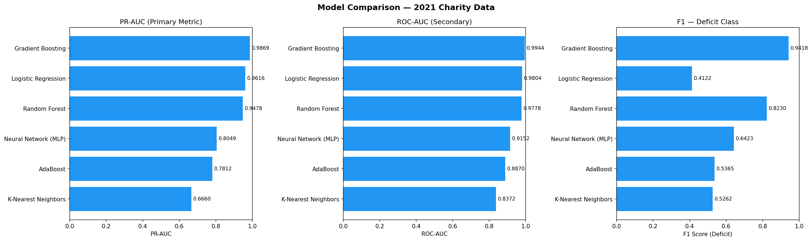
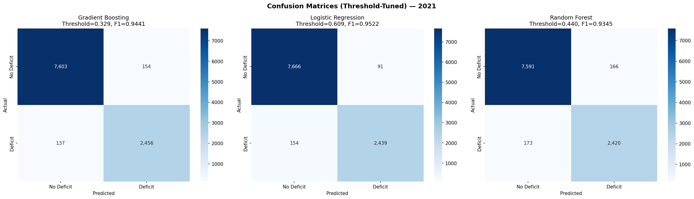
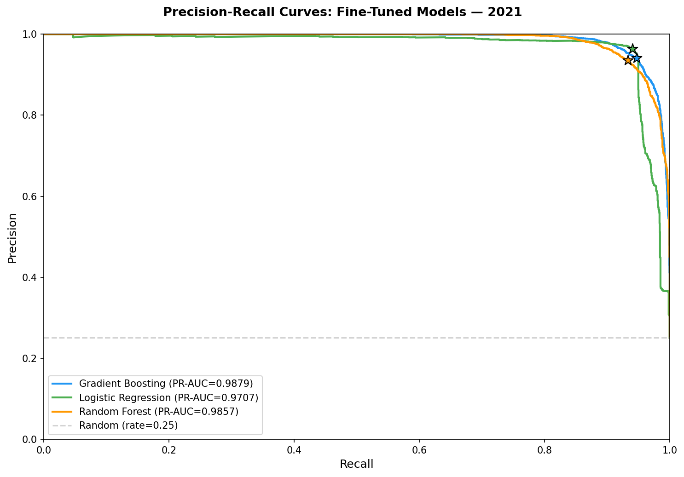
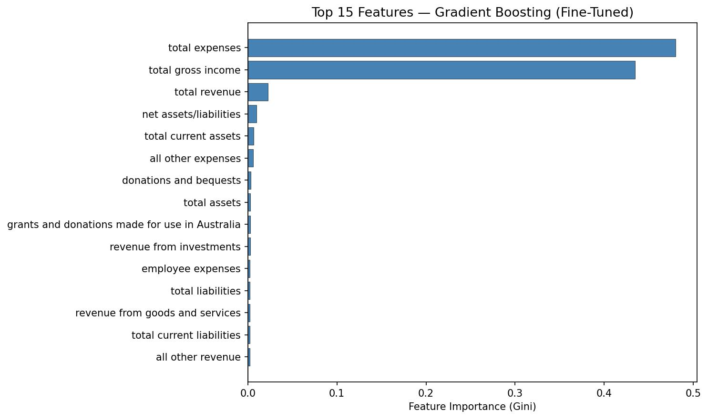

# Charity Deficit Prediction — Identifying Charities at Risk

**By Peter Berthon**

### Non-Technical, Executive Summary

Around one in four Australian charities reports spending more than they earn each year. This project used publicly available financial data from over 50,000 charities to build a model that can identify which charities are likely to end up in deficit. The aim is to give government regulators like the 'Australian Charities and Not-For-Profits Commision' (ACNC) a list of charity characteristics to monitor so they can offer support before financial problems become more serious. This is a benefit also to the sections of the Australian community that rely on these charitable and not-for-profits organisations (which includes Universities).

The model that performed best is called 'Gradient Boosting' — a technique that combines many small decision-making steps to arrive at a strong overall prediction. After testing six different approaches and carefully adjusting how sensitive each model should be, it was able to correctly identify the vast majority of charities in deficit, while keeping false alarms low. The biggest insight was that expense-related factors (total expenses, employee costs, other expenses) are far more predictive of deficit than revenue. This suggests that for charities, keeping a close watch on spending matters more than chasing income. The model could be used as a screening tool, with a sensitivity dial that can be adjusted depending on how many charities the ACNC wants to review at any given time - broadly for more charities at risk or more focused on the charities in the worst financial position.

### Technical Summary

This project investigates whether machine learning can identify Australian charities at risk of running a financial deficit using publicly available government data. Starting from a Logistic Regression baseline that caught only 3% of actual deficit cases, the project progressed through a coarse model comparison of six algorithms, fine hyperparameter tuning of the top three, and threshold optimisation.

The best model — Gradient Boosting with a tuned threshold of 0.3294 — achieved a PR-AUC of 0.9879, ROC-AUC of 0.9949, and F1 of 0.9441 on the deficit class. Threshold tuning was the single most impactful technique in the pipeline. Expense-side features (total expenses, employee expenses, other expenses) were the strongest predictors of deficit, suggesting charities should focus financial governance on expense management, not just revenue generation.

### Rationale

Charities and not-for-profits play an important role in communities. When they fall into financial deficit, the people who rely on their services are affected. The ACNC (Australian Charities and Not-for-profits Commission) collects annual financial data from over 50,000 registered charities. If a model could flag charities heading toward deficit, it could serve as an early warning system — allowing targeted support before financial problems become severe.

Either local, state or Federal governments provide some grants to some charities. This analysis can provide  government with more confidence about to will use a grant effectively and who will over spend and run into deficit.

### Research Question

Can we predict whether an Australian charity will report a financial deficit based on its Annual Information Statement (AIS) data? And if so, which features are the strongest predictors?

### Data Sources

The dataset comes from the Australian Government's open data portal:
https://www.data.gov.au/data/organization/acnc

- **Source file:** `datadotgov_ais21.xlsx`
- **Size:** 51,747 charities across 93 columns
- **Contents:** Annual Information Statement (AIS) financial data for 2021
- **Target:** `is_deficit` — a binary variable derived from `net surplus/deficit` (1 = deficit, 0 = no deficit)
- **Class balance:** Imbalanced — roughly 25% of charities report a deficit

The data is publicly available under Creative Commons Attribution 2.5 Australia.

### Methodology

The analysis followed a structured pipeline:

1. **Exploratory Data Analysis** — duplicate checks, missing values, descriptive statistics, signed-log histograms, correlation heatmaps, categorical distributions, boxplots by deficit status, interactive scatter plots (Plotly), outlier analysis via IQR, and financial ratio analysis.

2. **Feature Engineering** — created binary target column `is_deficit`, dropped leakage columns (net surplus/deficit, comprehensive income), removed non-predictive columns (ABN, charity name, dates).

3. **Preprocessing** — median imputation for numeric columns, one-hot encoding for categoricals, StandardScaler, 80/20 stratified train/test split.

4. **Baseline Model** — Logistic Regression (L2, lbfgs). ROC-AUC of 0.8492 but recall of only 3% for the deficit class. The default 0.5 threshold was holding back the model for the minority class.

5. **Coarse Model Comparison** — six models evaluated with RandomizedSearchCV using PR-AUC as the primary metric: Gradient Boosting, Random Forest, Logistic Regression, Neural Network (MLP), AdaBoost, and K-Nearest Neighbors.

6. **Fine Tuning** — the top three models (Gradient Boosting, Random Forest, Logistic Regression) were fine tuned with wider parameter grids and more iterations.

7. **Threshold Tuning** — optimal decision thresholds found by maximising F1 on the deficit class using the precision-recall curve.

Cross-validation was used throughout. PR-AUC was chosen as the primary metric because it is more informative than ROC-AUC for imbalanced datasets, focusing on performance for the minority (deficit) class.

### Results

**Baseline vs Best Model:**

| Metric | Baseline (Logistic Regression) | Best (Gradient Boosting) | Gain |
|--------|-------------------------------|--------------------------|------|
| PR-AUC | ~0.73 | 0.9879 | +0.26 |
| ROC-AUC | 0.8492 | 0.9949 | +0.15 |
| F1 (deficit) | 0.05 (est.) | 0.9441 | +0.90 |

Model selection and threshold tuning were the two most important decisions. There were two issues to grapple with for this imbalanced data: (1) a model's discrimination ability (AUC) and (2) its classification decisions (threshold).

The performance proved strong for the ensembles. However, Logistic Regression still performed very well — second place on PR-AUC but first place for F1 Score (0.9522). This showed that the financial features have strong linear separability once the decision boundary is correctly placed.

**Gradient Boosting** is the recommended model for deployment:
- Highest PR-AUC and ROC-AUC across all models — meaning it performs best across all possible thresholds, making it the most robust choice if operational requirements change.
- Feature importances that can be easily explained — the top features (total expenses, total revenue, employee expenses, gross income) align with general intuition. The model's decisions can be explained to non-technical parties.
- Handles the 75/25 class imbalance effectively with the optimised threshold of 0.3294.

**Feature insights:** Expense-side features are the strongest predictors of deficit. This suggests that charities should focus financial governance on expense management and monitoring, not just revenue generation.

### Recommendations for Next steps

- **Early warning system**: The model could be used as a screening tool by the ACNC to flag charities at risk of deficit. A charity flagged by the model could receive extra support or closer scrutiny of their next Annual Information Statement.
- **Adjustable threshold**: The 0.3294 threshold can be adjusted depending on whether the ACNC wants to focus on the most at-risk charities or cast a wider net. It could be set to be appropriate for the government/governance staffing levels at a particular time.
- **Retraining**: The model was trained on 2021 data. It should be retrained annually as new AIS data becomes available, and monitored for drift — particularly after rapid economic changes (e.g., post-COVID funding changes, inflation impacts from conflict such as ones involving the Middle East oil suppliers).
- **Multi-year features**: The model predicts deficit from a single year's financial snapshot. It cannot capture a trajectory (e.g., a charity with declining revenue over three years). Adding historical features from prior years would be a valuable enhancement. The Australian Government data portal has 11 years of data available (2013–2023).
- **Standardising Data across years**: The Excel files for other years have different file format in terms of column headings and other content eg. Some staffing levels are a range, not a number. When trying to run the code for a different year, I ran into these issues. I then made good headway on standardising other years to have the same format but was not able to completely standardise all the data for 2013-2023 with the time available. This would definitely be a next step to pursue.

### Outline of project

- [Jupyter Notebook — Full Analysis](charity_not-profits.ipynb)
- [Data Source — Australian Government](https://www.data.gov.au/data/organization/acnc)
- [Images — Graphs Created by NoteBook ](images)

### Contact and Further Information

Peter Berthon

GitHub: [bert-pe](https://github.com/bert-pe)
